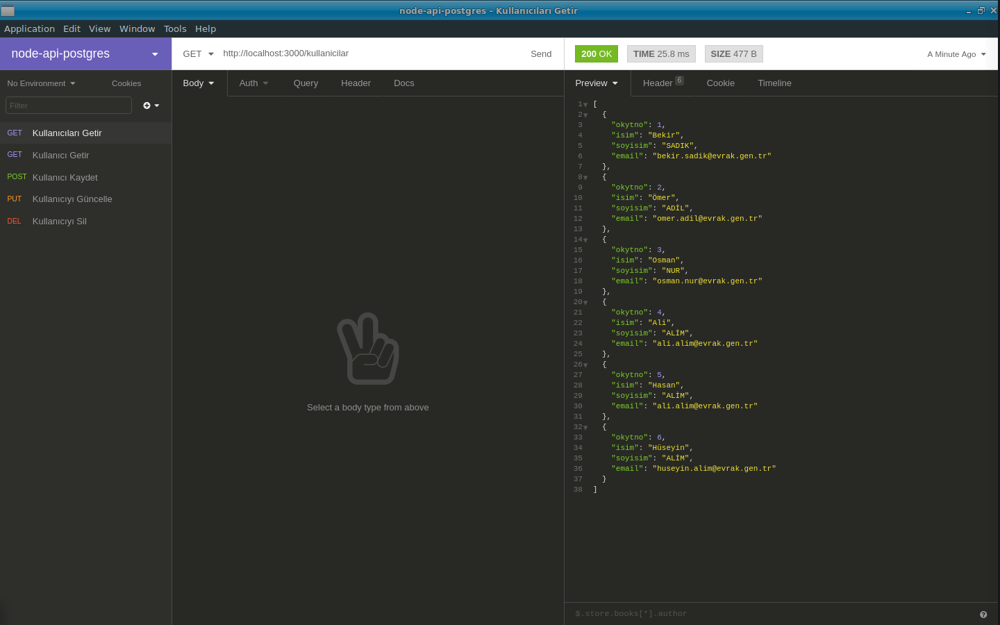
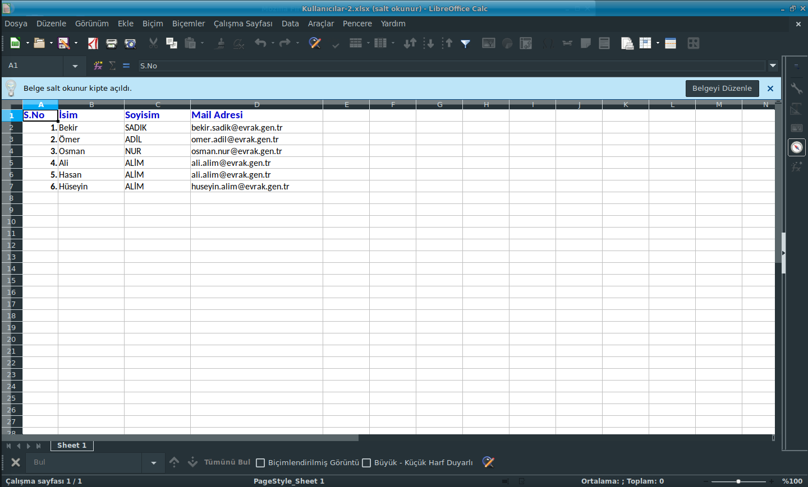

# PostgreSQL, Node.js(Express) kullanarak RESTful API yapımı. Xlsx Liste oluşturma. RESTful API construction using PostgreSQL, Node.js (Express). Create Xlsx list.

# Paketlerin Kurulumu, Installing Packages

```
npm i express pg --save
```

# Veritabanı işlemleri, Database Operations

```
Veritabanı işlemleri "db" dizininde mevcuttur.
E-) Database operations are available in the "db" directory.
```

# Çalıştırma, Running

```
$ node index.js
```

# Test

```
Test için Insomnia kullandım. Ekran görüntüsü evrak dizininde mevcuttur.
E-) I used Insomnia for the test. The screenshot is available in the "evrak" directory.
```

```
1.) Get: http://localhost:3000/kullanicilar

2.) Get: http://localhost:3000/kullanicilar/1

3.) Post: http://localhost:3000/kullanicilar
Post için örnek veriler.
E-) Post for sample data.
{"Isim":"Hasan","Soyisim":"ALİM","Email":"hasan.alim@evrak.gen.tr"}
{"Isim":"Hüseyin","Soyisim":"ALİM","Email":"huseyin.alim@evrak.gen.tr"}
{"Isim":"Silinecek","Soyisim":"VATANDAŞ","Email":"sil.gitsin@evrak.gen.tr"}

4.) Put: http://localhost:3000/kullanicilar/7
 (En son eklediğimiz kaydı değiştireceğiz.
E-) We'll change the last record we added.)
Put için örnek veri.
 E-) Sample data for Put.
{"Isim":"Az bekle seni","Soyisim":"SİLECEĞİM","Email":"muhlet.verilen@evrak.gen.tr"}

5.) Delete: http://localhost:3000/kullanicilar/7

6.) Xlsx Liste (Xlsx List): http://localhost:3000/kullanicilarxlsx
```

# Görüntüler




